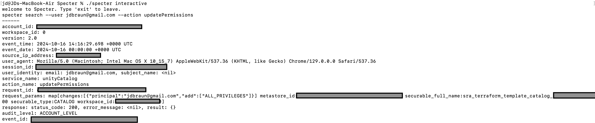
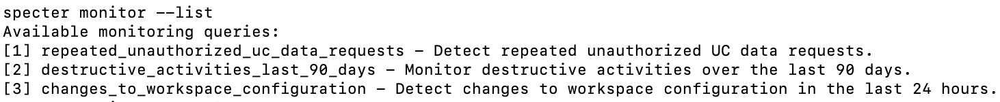
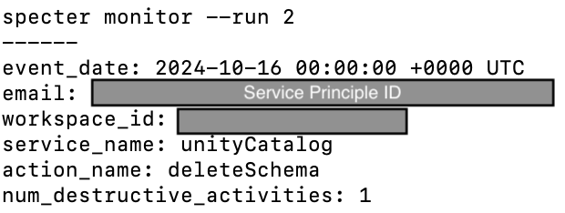

# Specter 👻

Specter is a CLI tool that lets you simply and quickly search and monitor your Databricks audit logs.

_**Are you ready to haunt your (lake)house?**_

----
## Key Features
- **Search Logs**: Filter and search through audit logs based on user, service, action, event time, and source IP.
- **Monitor Queries**: Run pre-defined monitoring queries to detect potentially suspicious activity.

----
## Under the Hood
- **[Unity Catalog](https://docs.databricks.com/en/admin/system-tables/index.html)**: Built-in audit log tables.
- **[Delta Sharing](https://docs.databricks.com/en/data-sharing/index.html)**: Open data sharing protocol. 
- **[DuckDB](https://duckdb.org/docs/connect/overview.html#in-memory-database) + [Go-DuckDB](https://github.com/marcboeker/go-duckdb)**: Fast in-memory SQL analysis.
- **[Cobra](https://cobra.dev/)**: Go CLI framework.

----
## Installation
- Create a new table from system.access.audit.
  - **NOTE**: If you're in the [private preview](https://www.databricks.com/resources/other/request-access-databricks-delta-sharing-materialized-views-and-streaming-tables), you could try Delta Sharing a materialized view for fresher data.
  - **NOTE**: These audit tables may contain **a lot** of data depending on your Databricks usage. It's recommended to review the size and filter down based on your org's requirements.

```sql
CREATE OR REPLACE TABLE logging
AS select * from system.access.audit 
where event_time >= '2024-01-01T00:00:00'
```
- Create a Delta Share for the table.
  - [Set-up Delta Sharing](https://docs.databricks.com/en/delta-sharing/set-up.html)
  - [Add a recipient](https://docs.databricks.com/en/delta-sharing/grant-access.html#grant-recipient-access-to-share)
  - [Create a share](https://docs.databricks.com/en/delta-sharing/create-share.html)
  - [Add IP of compute executing Specter to IP ACL](https://docs.databricks.com/en/delta-sharing/access-list.html)

- Download [config.share](https://docs.databricks.com/en/delta-sharing/read-data-open.html#databricks-read-shared-data-using-open-sharing-connectors) file from activation link.
  - **NOTE:** This should be considered extremely sensitive!
- Download [Go](https://go.dev/) (1.21+ required).
```bash
go version
```
- Clone the repository and download dependencies.

```bash
git clone https://github.com/jdbraun/specter.git
cd specter
go mod tidy
mkdir config
```

- Add the config.share file to /config.
- Run the following commands.

```bash
go build -o specter
./specter interactive
```

----
## Usage
### Search
The `search` command allows you to filter audit logs based on various criteria like user, service, and action.

**All available service and action names can be found in the [documentation](https://docs.databricks.com/en/admin/account-settings/audit-logs.html).**

```bash
specter search --user user@email.com --service clusters --action delete --date "2024-10-09" --export results
```

- `--user`: Filter by user email (e.g., `user@databricks.com`).
- `--service`: Filter by service name (e.g., `clusters`).
- `--action`: Filter by action name (e.g., `delete`).
- `--date`: Filter by event date (e.g., `2024-10-09`).
- `--export`: Export the results to a CSV file (e.g., `permissionsCheck`).

### Monitor
The `monitor` command runs pre-defined SQL queries that can help you detect potential security issues.

```bash
specter monitor --list
specter monitor --run 1
```

- `--list`: Lists all the pre-defined monitoring queries.
- `--run`: Runs a specific monitoring query by its number or all if set to `0`.

### Monitoring Queries
- **repeated_unauthorized_uc_data_requests** - Detect repeated unauthorized UC data requests
     
- **destructive_activities_last_90_days** - Monitor destructive activities over the last 90 days
- **changes_to_workspace_configuration** - Detect changes to workspace configuration in the last 24 hours


```bash
specter monitor --list 
```
Monitoring queries sourced from the [repository](https://github.com/andyweaves/system-tables-audit-logs) for the blog post: [Improve Lakehouse Security Monitoring using System Tables in Databricks Unity Catalog](https://www.databricks.com/blog/improve-lakehouse-security-monitoring-using-system-tables-databricks-unity-catalog).

----
## Examples
### Search Results:


### Monitor List Results:


### Monitor Results:


----
## Limitations
- Specter has only been validated on MacOS and Databricks on AWS.
- Data needs to be incrementally refreshed at source until materialized view Delta Sharing is out of private preview.


----
## License
This project is licensed under the Apache 2.0 License - see the [LICENSE](LICENSE) file for details.

----
## Contributions
Feel free to contribute by submitting issues or pull requests. 
